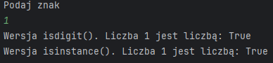
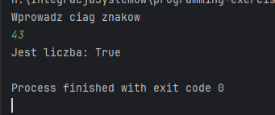
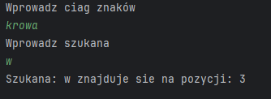
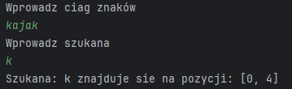
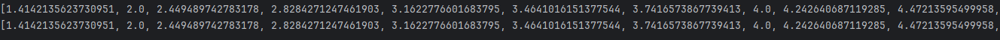

# Exercise-01
Napisz program (na dwa sposoby), który sprawdza czy wczytany pojedynczy znak jest cyfrą lub nie. Jeśli wczytamy więcej znaków, należy wziąć tylko pierwszy.
Hint: skorzystaj z funkcji isdigit() i isinstance().

[Exercise-01](task-01.py)

.

# Exercise-02
Napisz program, który sprawdza czy wczytany łańcuch znakowy jest liczbą lub nie. Muszą być wczytane co najmniej dwa znaki.
Hint: skorzystaj z funkcji all().

[Exercise-02](task-02.py).

# Exercise-03
Napisz program, który szuka określonego ciągu znaków w łańcuchu znakowym i zwraca indeks pierwszego wystąpienia ciągu lub -1, gdy nie ma takiego ciągu.
Hint: skorzystaj z funkcji find().

[Exercise-03](task-03.py).

# Exercise-04
Napisz program, który szuka określonego ciągu znaków w łańcuchu znakowym i zwraca indeksy wszystkich wystąpień ciągu lub -1, gdy nie ma takiego ciągu.
Hint: skorzystaj z funkcji split().

[Exercise-04](task-04.py).

# Exercise-05
Napisz program (na dwa sposoby), który szuka pierwiastków liczb od 1 do 256 (włącznie) podzielnych bez reszty przez 2.
Hint: skorzystaj z modułu math i z tzw. 'list comprehensions'.

[Exercise-05](task-05.py).

