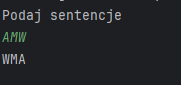

# Exercise-01
Napisz program (na dwa sposoby), który sprawdza czy wczytany pojedynczy znak jest cyfrą lub nie. Jeśli wczytamy więcej znaków, należy wziąć tylko pierwszy.
Hint: skorzystaj z funkcji isdigit() i isinstance().

[Exercise-01](task-01.py)

.

# Exercise-02
Napisz program, który sprawdza czy wczytany łańcuch znakowy jest liczbą lub nie. Muszą być wczytane co najmniej dwa znaki.
Hint: skorzystaj z funkcji all().

[Exercise-02](task-02.py).

# Exercise-03
Napisz program, który szuka określonego ciągu znaków w łańcuchu znakowym i zwraca indeks pierwszego wystąpienia ciągu lub -1, gdy nie ma takiego ciągu.
Hint: skorzystaj z funkcji find().

[Exercise-03](task-03.py).

# Exercise-04
Napisz program, który szuka określonego ciągu znaków w łańcuchu znakowym i zwraca indeksy wszystkich wystąpień ciągu lub -1, gdy nie ma takiego ciągu.
Hint: skorzystaj z funkcji split().

[Exercise-04](task-04.py).

# Exercise-05
Napisz program (na dwa sposoby), który szuka pierwiastków liczb od 1 do 256 (włącznie) podzielnych bez reszty przez 2.
Hint: skorzystaj z modułu math i z tzw. 'list comprehensions'.

[Exercise-05](task-05.py).

# Exercise-06
Napisz program, który tworzy słownik o nazwie zawierającej Twój numer albumu.
Kluczami powinny być liczby od 10 do 20, a wartościami pseudolosowe łańcuch znaków o długości 8.
Hint: skorzystaj z modułów string i random.

[Exercise-06](task-06.py).

# Exercise-07
Stwórz folder utils, a w nim plik 'obliczenia.py', w którym należy zaimplementować cztery wybrane funkcje matematyczne z modułu math.
Następnie należy utworzyć plik skrypt7-nr_albumu.py i zaimportować w nim ww. funkcje do obliczeń na przykładowych wartościach.

[Exercise-07](task-07.py)

[Obliczenia](utils/obliczenia.py)

# Exercise-08
Napisz program, który generuje losowy ciąg znaków o 
długości 100, a następnie utwórz słownik którego kluczami 
będą unikalne znaki występujące w ciągu, a wartościami 
liczba ich wystąpień w ciągu znakowym. 
Utwórz listę, której każdy element to krotka (tupla), 
zawierająca kolejny klucz z ww. słownika i odpowiadającą mu wartość liczbową.
Hint: skorzystaj z modułu collections i klasy Counter().

[Exercise-08](task-08.py)

# Exercise-09
Stwórz klasy Vehicle i Car z polami nazwa, rok_produkcji i przebieg oraz metodami is_old() i is_long_mileage(). Stwórz po jednym obiekcie dla każdej z klas oraz trzeci obiekt, gdzie klasa Car dziedziczy z klasy Vehicle. Dla każdego z obiektów wywołaj obie metody, co najmniej raz użyj dekoratora @property w każdym z trzech przypadków.

[Exercise-09](task-09.py)

# Exercise-10
Napisz program, który korzystająć z metody chr() wygeneruje łańcuch znakowy z alfabetem, czyli 'abc....xyz'. Do pliku alfabet1-numeralbumu.txt zapisz wygenerowany łańcuch znakowy, a do pliku alfabet2-numeralbumu.txt zapisz litery z ww. łańcucha znakowego, tylko że każda litera ma się znaleźć w osobnej linii w pliku.
Hint: oprócz funkcji write() skorzystaj również z menadżera kontekstu with, żeby nie zapomnieć o zamknięciu pliku.

[Exercise-10](task-10.py)

# Exercise-11
Odwrócić sentencję podaną przez użytkownika.

[Exercise-11](task-11.py)

# Exercise-12
Zamienić wszystkie litery o na 0, e na 3, i na 1, a na 4 w podanej przez użytkownika sentencji.

[Exercise-12](task-12.py)

# Exercise-13
Używając pętli wyświetl liczby w przedziale od 1 do 50 oprócz liczb podzielnych przez 3.

[Exercise-13](task-13.py)

# Exercise-14
Używając pętli wyświetl liczby w przedziale od 1 do 100 podzielne przez 3 i 4 oraz podaj ich liczbę.

[Exercise-14](task-14.py)

# Exercise-15
Używając pętli dodawaj do wcześniej zadeklarowanej tabeli liczby z przedziału od 1 do 100, które są podzielne przez 3 lub podzielne przez 5.

[Exercise-15](task-15.py)

# Exercise-16
Napisz prostą funkcję o nazwie potega(), przyjmującą jeden argument, podnoszącą podaną liczbę do trzeciej potęgi.

[Exercise-16](task-16.py)

# Exercise-17
Stwórz klasę o nazwie Dog, która będzie posiadała zmienne takie jak: name, age, coat_color. Dodatkowo klasa posiada funkcje sound(), po wywołaniu której wypisywany jest tekst: {name} is barking! Stworzyć 3 obiekty klasy Dog.

[Exercise-17](task-17.py)

# Exercise-18
Stworzyć plik funkcje.py, w którym należy zaimplementować funkcję: dodawanie, odejmowanie, dzielenie, mnożenie oraz modulo. W pliku main.py zaimportować plik funkcje.py i wykorzystać zaimportowane funkcje na przykładowych wartościach.

[Exercise-18](task-18.py)

[Funkcje](funkcje.py)

# Exercise-19
Sprawdź czy wyraz bądź zdanie podane przez użytkownika jest palindromem.

[Exercise-19](task-19.py)

# Exercise-20
Prosta gra, program generuje losową liczbę od 1 do 100, użytkownik ma odgadnąć liczbę, jeżeli nie trafi ma zostać wyświetlona podpowiedź czy za duża czy za mała liczba.

[Exercise-20](task-20.py)

# Exercise-21
Dziedziczenie klas. Klasa Animal ma zawierać atrybuty takie jak name, age, sex oraz metodę sound(). Klasy Dog, Cat oraz Fox dziedziczą po klasie Animal oraz nadpisują funkcje sound() odpowiednimi dźwiękami, dodatkowo klasy Dog oraz Cat posiadają atrybut breed.
[Exercise-21](task-21.py)

