# Exercise-01
Write a SQL query to select the sex and body mass columns from the little_penguins in that order, sorted such that the largest body mass appears first.

```sqlite
SELECT sex, body_mass_g
FROM penguins
ORDER BY body_mass_g desc
```

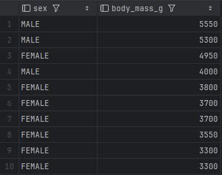.

# Exercise-02
Write a SQL query to select the islands and species from rows 50 to 60 inclusive of the penguins table. Your result should have 11 rows.
```sqlite
SELECT island,species
FROM penguins
LIMIT 11 OFFSET 49
```

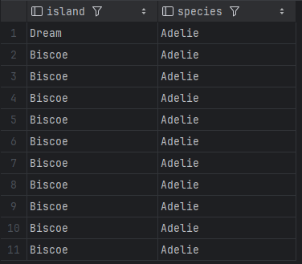.

# Exercise-03
Modify your query to select distinct combinations of island and species from the same rows and compare the result to what you got in part 1.    

```sqlite
DOZROBIENIA
```

.

# Exercise-04
Write a query to select the body masses from penguins that are less than 3000.0 grams.
```sqlite
SELECT body_mass_g
FROM penguins
WHERE body_mass_g <3000
```

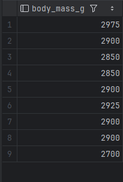.

# Exercise-05
Write another query to select the species and sex of penguins that weight less than 3000.0 grams. This shows that the columns displayed and those used in filtering are independent of each other.
```sqlite
SELECT species, sex
FROM penguins
WHERE body_mass_g <3000
```

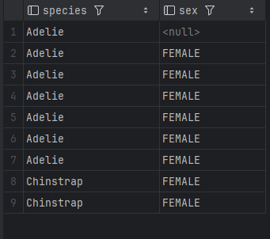.

# Exercise-06
Use the not operator to select penguins that are not Gentoos.
```sqlite
SELECT species
FROM penguins
WHERE species != 'Gentoo'
```

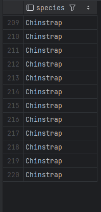.

# Exercise-07
SQL's or is an inclusive or: it succeeds if either or both conditions are true. SQL does not provide a specific operator for exclusive or, which is true if either but not both conditions are true, but the same effect can be achieved using and, or, and not. Write a query to select penguins that are female or on Torgersen Island but not both.

```sqlite
SELECT *
FROM penguins
WHERE (sex = 'FEMALE' AND island !='Torgersen')
   OR
    (sex != 'FEMALE' AND island ='Torgersen')
```

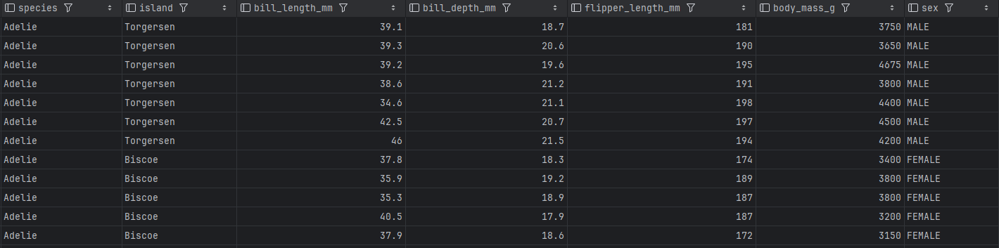.

# Exercise-08
Write a single query that calculates and returns:
A column called what_where that has the species and island of each penguin separated by a single space.

```sqlite
SELECT concat(species, ' ',island) as what_where
FROM penguins
```

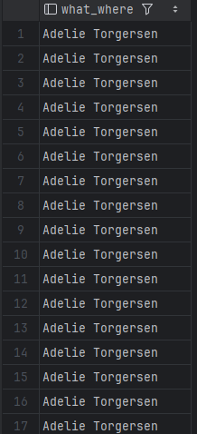.

# Exercise-09
Write a single query that calculates and returns:
A column called bill_ratio that has the ratio of bill length to bill depth.
```sqlite
SELECT bill_length_mm/bill_depth_mm as bill_ratio
FROM penguins
```

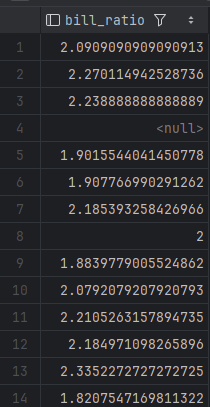.

# Exercise-10
Use SQLite's .nullvalue command to change the printed representation of null to the string null and then re-run the previous query. When will displaying null as null be easier to understand? When might it be misleading?
```sqlite
.nullvalue 'null'
SELECT
    flipper_length_mm / 10.0 as flipper_cm,
    body_mass_g / 1000.0     as weight_kg,
    island                   as where_found
from penguins
    limit 5;
```

.

# Exercise-11
Write a query to find penguins whose body mass is known but whose sex is not.

```sqlite
SELECT *
FROM penguins
WHERE sex IS NULL AND body_mass_g IS NOT NULL
```

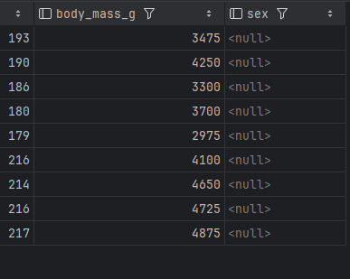.


# Exercise-12
Write another query to find penguins whose sex is known but whose body mass is not.

```sqlite
SELECT *
FROM penguins
WHERE sex IS NOT NULL AND body_mass_g IS NULL
```

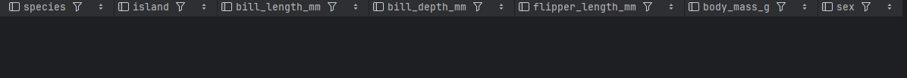.

# Exercise-13
What is the average body mass of penguins that weight more than 3000.0 grams?

```sqlite
SELECT AVG(body_mass_g)
FROM penguins
WHERE body_mass_g > 3000
```

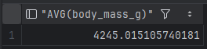.

# Exercise-14
How many different body masses are in the penguins dataset?
```sqlite
SELECT AVG(body_mass_g)
FROM penguins
WHERE body_mass_g > 3000
```

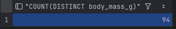.
